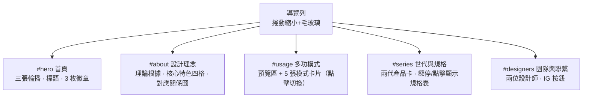
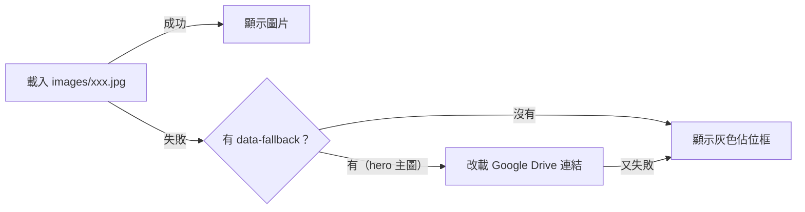

# 畫作椅 Painting Chair — 產品介紹網站

> 以蒙德里安冷抽象美學為靈感的多功能兒童家具：懸掛時是一幅畫，拆解後是隨孩子成長調整的兒童椅。
> 一幅畫（1300×1030 mm）內含 **2 把**兒童椅構件，取下後畫作依然完整；可回收樺木打造，遵循 5R 永續原則。
> 🏅 2021 當代好設計獎（第一代）｜🏛️ 臺中區農業改良場展覽（第二代）

| 連結 | 網址 |
|------|------|
| 🌐 線上網站（GitHub Pages） | https://ziqing-hub.github.io/PaintingChair/ |
| 📷 Instagram | https://www.instagram.com/painting_chair |
| 📦 Repo | https://github.com/ziqing-hub/PaintingChair |

> 📝 本 README 為**自用備忘**：記錄網站架構、維護方式與待辦事項。
> 完整產品文案（中英、長中短三版）存放於 [docs/product-description.md](docs/product-description.md)。

---

## 📁 檔案結構

```
PaintingChair/
├── index.html                  # 整個網站（單頁式，HTML+CSS+JS 全在此檔）
├── README.md                   # 本檔：維護備忘
├── docs/
│   └── product-description.md  # 官方產品描述母版（投獎/參展/媒體用）
└── images/
    ├── README.md               # 圖片清單、命名規則、尺寸建議 ⭐ 補圖前必看
    └── （圖片檔，依清單命名放入即自動顯示）
```

## 🗺️ 網站架構

單頁式網站，導覽列錨點對應五大區塊：



| 區塊 | 內容重點 | 互動行為 |
|------|----------|----------|
| `#hero` | 主視覺輪播×3、品牌標語、獎項徽章 | swipe／箭頭／圓點切換，Apple 式露邊 |
| `#about` | Zieger 理論、平面轉立體論述、核心特色四格（一畫兩椅／畫作恆完整／隨成長調整／模組化） | 進場 reveal 動畫 |
| `#usage` | 五種模式：藝術畫作、兒童組合椅、置物架、邊几/茶几、玄關桌 | 點卡片→預覽區載入對應圖片 |
| `#series` | 第一代（淺色/得獎）、第二代（深色/展覽）＋ 7 列規格表 | 桌機 hover／手機 tap 顯示規格 |
| `#designers` | 高子晴（主設計師）、劉芃均（設計顧問）、IG 連結 | 頭像 hover 放大 |

## 🛠️ 技術棧與實作重點

- **零建置流程**：單一 `index.html`，直接開檔即網站，push 即部署
- **Tailwind CSS**（CDN Play 版）＋ 自訂 CSS
  - 品牌色與動畫節奏統一放在 `:root` CSS 變數（`--brand-green: #5b6d5f` 等）
  - ⚠️ CSS 有「基底層＋視覺打磨層」兩層結構，後者刻意覆蓋前者（檔內有註解標記），改視覺請改打磨層
- **字型**：Noto Sans TC（Google Fonts）＋ 品牌字 Bauhaus 93（僅 Windows 內建，其他平台 fallback 到 Arial Black）
- **原生 JS**（無框架）：
  - 導覽 scroll-spy 高亮＋捲動縮小
  - `IntersectionObserver` 進場 reveal 動畫
  - Hero 輪播：scroll-snap ＋ 置中偵測（swipe/箭頭/圓點三種操作）
  - 多功模式 `switchMode()`：載入 `images/mode-<key>.jpg`，缺檔自動退回文字佔位
  - 規格表：桌機 hover、手機 tap 切換（互斥開啟）
- **無障礙**：`aria-label`、`prefers-reduced-motion` 支援

### 圖片載入備援機制

全站圖片皆有「缺檔不破圖」保護：



## 👀 本地預覽

```
方法一：直接雙擊 index.html（最快）
方法二：VS Code 裝 Live Server 擴充 → 右鍵 index.html → Open with Live Server（建議，改檔自動重整）
方法三：python -m http.server 8000 → 開 http://localhost:8000
```

## 🚀 部署（GitHub Pages）

- 部署來源：`main` 分支根目錄，**push 後 1～2 分鐘自動上線**
- 流程：改檔 → `git add -A` → `git commit -m "說明"` → `git push`
- 確認：等 1~2 分鐘後開網站按 `Ctrl+F5` 強制重新整理；或到 repo 的 Actions 頁看 pages build 狀態
- Repo 維持 **public**（產品介紹網站，方便分享；2026-07 決定）

## 🖼️ 圖片管理

**所有圖片路徑已在程式碼接好**——依 [images/README.md](images/README.md) 的清單命名放入 `images/` 即自動顯示，共 14 個位置（3 輪播＋1 理念圖＋5 模式圖＋2 產品圖＋2 頭像＋1 社群分享圖）。

## ✏️ 常見修改速查表

| 想改什麼 | 改哪裡（都在 index.html） |
|----------|--------------------------|
| 首頁標語 | `#hero` 區的 `<h1>` 與其下 `<p>` |
| 獎項徽章 | `#hero` 區三個 `chip` span |
| 設計理念文字 | `#about` 區兩段 `<p>` |
| 核心特色四格 | `#about` 區「核心特色四格」註解下方 |
| 模式卡片名稱/副標 | `#usage` 區 `.mode-card`（改圖檔鍵值要同步改 `switchMode` 第二參數） |
| 規格表數值 | `#series` 區 `.spec-row`（「量測後補上」的灰字待補欄位也在這） |
| 兩代產品文案 | `#series` 區各卡片底部 `<p>` |
| 設計師姓名/語錄 | `#designers` 區 |
| IG 連結 | `#designers` 區 `.ig-button` 的 `href` |
| 品牌色 | `<style>` 開頭 `:root` CSS 變數（部分色碼如 `#5b6d5f` 散落各處，全域改色建議全檔搜尋替換） |
| SEO/分享文案 | `<head>` 的 `meta description` 與 `og:` 系列 |

## ⚠️ 已知問題與待辦

- [ ] **【重要】Hero 主圖訪客看不到**：Google Drive 圖床檔案未開公開分享，一般訪客載入失敗會自動退回灰色佔位框（不會破圖，但主視覺等於沒有圖；自己看正常是因為瀏覽器已登入 Google）。→ 解法：把原圖存為 `images/hero-02-family.jpg` 放入 repo（程式已設本地優先）
- [ ] **補齊 14 張圖片**（清單見 [images/README.md](images/README.md)），目前全站僅佔位框
- [ ] **規格數據待補**：適用年齡、椅面高度調整檔位、承重（`#series` 規格表已留灰字欄位）
- [ ] **文獻引用待求證**：網站與文案寫「齊格 (Zieger, 1999)」，查無此研究；高度疑似為神經美學學者 **Semir Zeki**《Inner Vision》(1999)——研究「蒙德里安式直線方塊刺激視覺皮質」的正是他，年份主題吻合。找到原始出處確認後統一修正（詳見 [docs/product-description.md](docs/product-description.md) 註記）
- [ ] `og-cover.jpg` 社群分享圖待製作（1200×630），現在貼連結到 LINE/FB 不會有預覽圖
- [ ] Bauhaus 93 字體僅 Windows 內建，Mac/手機顯示 Arial Black → 講究的話可改 webfont 或做 SVG logo
- [ ] Tailwind 用 CDN Play 版（console 會有 production 警告）→ 個人展示站可接受，若日後流量大再改 CLI build
