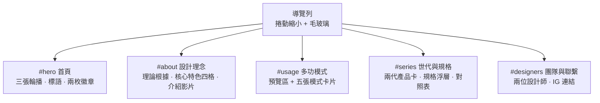
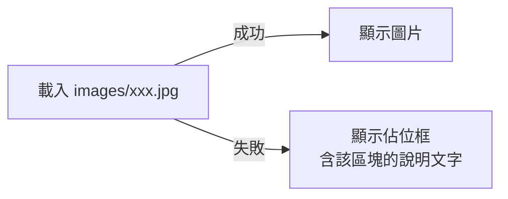

# 畫作椅 Painting Chair

> 以蒙德里安冷抽象美學為靈感的多功能兒童家具。
> 懸掛時是一幅畫，拆解後是隨孩子成長調整的兒童椅；一幅畫含小／中／大**三種尺寸**的椅構件，
> 同時可組出兩把，取下後畫作依然完整。
>
> 🏅 2021 當代好設計獎（第一代）　🏛️ 臺中區農業改良場展覽（第二代）

| | |
|---|---|
| 線上網站 | https://ziqing-hub.github.io/PaintingChair/ |
| Instagram | https://www.instagram.com/painting_chair |

**設計**：高子晴（主設計師）、劉芃均（設計顧問）

完整產品文案（中英、長中短三版）：[docs/product-description.md](docs/product-description.md)

---

## 這個 repo 是什麼

「畫作椅」單頁產品介紹網站的原始碼。

整個網站就是一個 `index.html`——HTML、CSS、JavaScript 全部寫在同一個檔案裡，
**沒有建置流程、沒有相依套件、不需要 npm install**。下載後雙擊就能在瀏覽器裡看到完整網站。

```
PaintingChair/
├── index.html                  整個網站（單檔，約 2350 行）
├── README.md                   本檔
├── MAINTENANCE.md              維護指引：改文字、換圖片、更新網站
├── .gitignore                  列出不進版控的檔案
├── docs/
│   └── product-description.md  產品文案母版（投獎／參展／媒體用）
├── images/
│   ├── README.md               圖片清單、命名規則、尺寸建議
│   └── （圖片檔，依清單命名放入即自動顯示）
└── tools/
    └── wordmark-svg.mjs        把文字轉成商標 SVG 的小工具
```

---

## 網站架構

單頁式網站，導覽列錨點對應五大區塊：


```mermaid
graph TD
    NAV[導覽列<br>捲動縮小 + 毛玻璃] --> HERO["#hero 首頁<br>三張輪播 · 標語 · 兩枚徽章"]
    NAV --> ABOUT["#about 設計理念<br>理論根據 · 核心特色四格 · 介紹影片"]
    NAV --> USAGE["#usage 多功模式<br>預覽區 + 五張模式卡片"]
    NAV --> SERIES["#series 世代與規格<br>兩代產品卡 · 規格浮層 · 對照表"]
    NAV --> TEAM["#designers 團隊與聯繫<br>兩位設計師 · IG 連結"]
```

| 區塊 | 內容 | 互動 |
|---|---|---|
| `#hero` | 主視覺輪播 ×3、品牌標語、獎項與展覽徽章 | 滑動／箭頭／圓點切換；循環輪播、左右露邊。可拖曳色調滑桿比較第一代與第二代 |
| `#about` | 環境教育論述、平面轉立體的設計理念、核心特色四格、介紹影片 | 進場淡入；點擊播放影片（播放時框改為 16:9） |
| `#usage` | 五種模式：藝術畫作、兒童組合椅、置物架、邊几／茶几、玄關桌 | 點卡片 → 預覽區載入對應圖片 |
| `#series` | 第一代（溫潤淺色／得獎作）、第二代（經典深色／展覽作）與兩代規格對照 | 桌機滑入、手機點擊顯示重點規格；另可展開七項完整規格對照表 |
| `#designers` | 兩位設計師介紹與 Instagram 連結 | 頭像滑入放大 |

---

## 技術做法

- **零建置流程**：單一 `index.html`，開檔即網站，push 即部署（GitHub Pages）
- **Tailwind CSS**（CDN Play 版）＋自訂 CSS
  - 品牌色與動畫節奏集中在 `:root` CSS 變數（`--brand-green: #5b6d5f` 等）
  - CSS 分成「基底層」與「視覺打磨層」兩層，後者刻意覆蓋前者（檔內有註解標記界線）。
    調整視覺請改打磨層
- **字型**：內文 Noto Sans TC（Google Fonts）
- **商標為 SVG 輪廓**：直接從字型檔取出真實輪廓，不依賴使用者裝了什麼字型，
  所以 Windows／macOS／iOS 顯示完全一致。顏色吃 `currentColor`
- **原生 JavaScript**（無框架）：
  - 導覽 scroll-spy 高亮、捲動縮小
  - `IntersectionObserver` 進場動畫
  - 首頁循環輪播：`scroll-snap` ＋前後各兩張複製格，滑到最後一張可繼續往前回到第一張
  - 色調滑桿：以 CSS `mask-image` 做羽化交界，比較兩代配色
  - 多功模式 `switchMode()`：載入 `images/mode-<key>.jpg`
  - 規格浮層：桌機滑入、手機點擊（互斥開啟）
- **無障礙**：`aria-label`、鍵盤操作、`prefers-reduced-motion` 支援；
  中文字級一律 12px 以上

### 缺圖不破圖

全站圖片都有保護機制，任何一張圖缺檔都不會讓版面壞掉：


```mermaid
flowchart LR
    A[載入 images/xxx.jpg] -->|成功| B[顯示圖片]
    A -->|失敗| C[顯示佔位框<br>含該區塊的說明文字]
```

首頁的色調滑桿另有一層保護：某一張缺少淡色版時，**只有那一張**的滑桿隱藏，其他張照常。

---

## 本機預覽

**最簡單**：雙擊 `index.html`。

**要看到頁內播放影片**：影片是 YouTube 嵌入，用 `file://` 直接開檔時 YouTube 會拒絕嵌入
（顯示「錯誤 153」），這是瀏覽器的來源限制，不是設定錯誤。程式已針對這種情況改成另開分頁。
想在本機看到真正的頁內播放，在專案資料夾執行：

```bash
python -m http.server 8000
```

再開 `http://localhost:8000`。

---

## 維護

| 想做的事 | 看這裡 |
|---|---|
| 換照片、加照片、圖片比例與命名規則 | [images/README.md](images/README.md) |
| 改網站文字、改商標、把改動更新到線上 | [MAINTENANCE.md](MAINTENANCE.md) |
| 取用產品文案（中英、長中短三版） | [docs/product-description.md](docs/product-description.md) |

---

## 著作權

網站程式碼、產品照片與文案均屬作者所有。
如需引用作品圖文或洽談合作，請透過上方 Instagram 聯繫。
